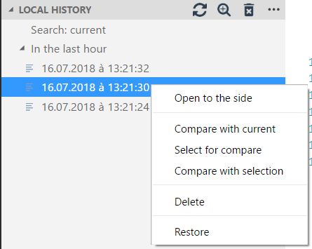

# Local History

A visual source code plugin for maintaining local history of files.

Every time you modify a file, a copy of the old contents is kept in the local history.
At any time, you can compare a file with any older version from the history.
It can help you out when you change or delete a file by accident.
The history can also help you out when your workspace has a catastrophic problem.
Each file revision is stored in a separate file inside the .history folder of your workspace directory
(you can also configure another location, see local-history.path).
e.g., `.history/foo/bar/myFile_20151212205930.ts`

You can easily navigate between history files with the `local-history tree` in the explorer pane. 
When you click on a file, a comparaison with the current version is displayed. 
You can also access other commands via a context menu. 

There is also an html-document (command: `View: Local history`)

## Settings

        "local-history.daysLimit":  30  // A day number to purge local history. (0: no purge)
        "local-history.maxDisplay": 10  // A max files to display with local history commands
        "local-history.saveDelay":   0  // A delay in seconds to save file in local history. {0: no delay}
        "local-history.dateLocale":     // The locale to use when displaying date

        "local-history.path":     // Specify another location for .history folder (null: use workspaceFolder)
            This settings must be an abolute path. You can also start your path with:
            ${workspaceFolder}: current workspace folder
                e.g. ${workspaceFolder}/.vscode to save in each workspace folder .vscode/.history
            ${workspaceFolder: 0}: first workspace folder
                e.g. workspace folders A, B, C. But save always in A/.history
        "local-history.absolute": // Save absolute or relative path in local-history.path
            true:  (absolute) // <local-history.path>/.history/<absolutePath>
            false: (relative) // (default) <local-history.path>/.history/<workspaceFolder.basename>/<relativePath>

        "local-history.enabled":
            0: Never     // Possibillity to disabled the extension for some project
            1: Always    // (default) Save also single file with no workspaceFolder ("local-history.path" must be defined)
            2: Workspace // Save only files within workspaceFolder

        "local-history.exclude": // Files or folders to not save
            // (default) ['**/.history/**', '**/.vscode**', '**/node_modules/**', '**/typings/**', '**/out/**']

        "local-history.filename":
            // use §p and ${workspaceFolder} only at the start of the name ('($p|${workspaceFolder})...'),
            $p                 - folder of file // (default)
            ${workspaceFolder} - project base folder

            $n                 - file name
            $e                 - file ending

            $H                 - hour
            $M                 - Minute
            $d                 - Day
            $m                 - Month
            $Y                 - Year

            $c                 - counter ($Xc) where X is number of displayed numbers 
            $u                 - Username
            $s                 - Session

        "local-history.maxVersionCount":
            -1 // (default) infinite

        "local-history.saveOneStepAhead":
            true // (default) The latest copy is equal to the source file
            false // The latest copy is the pervies stand of the source file

        "local-history.filenamePattern": // Files to save by filename pattern
            * - matches 0 or more characters
            !  - prefix marks the pattern as being negative, meaning that only files that don't match the pattern will be included.

            ['**'] // (default)

## Commands

    local-history.showAll // Show all history available to select (limited with maxDisplay settings)
    local-history.showCurrent // Show current version (if history version is active)
    local-history.compareToCurrent // compare current version with another version in history
    local-history.compareToActive // compare active file with another version in history
    local-history.compareToPrevious // compare a version in history with its previous version

    local-history.showViewer // Show the history in a html document

## Note
When .history folder is stored in workspace, you can add a "files.exclude".
This hides .history folder and avoids some issues. (e.g. csproj extension) 
Thanks to @pabloarista (issue [#13](https://github.com/zabel-xyz/local-history/issues/13))
